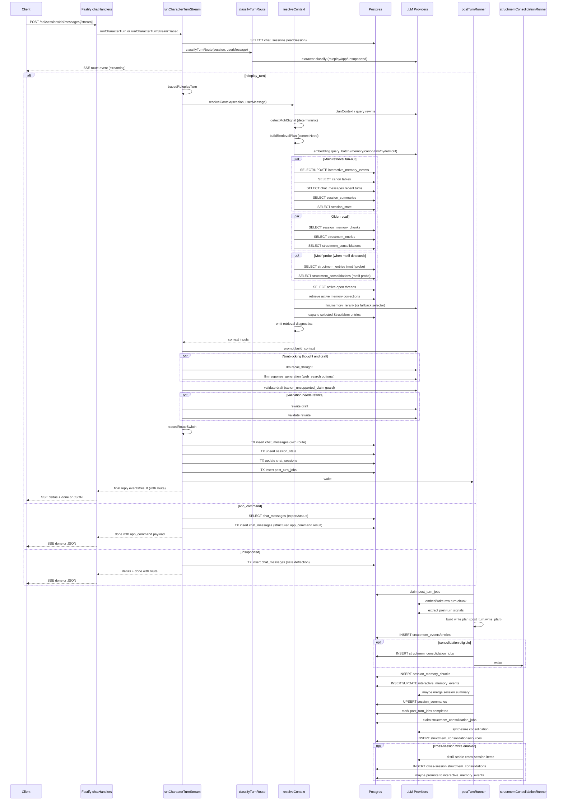

# Chatbot Backend Turn Workflow Analysis

This document describes the current `chatbot/backend` turn flow: how a user
message enters the API, how retrieval and generation are orchestrated, how the
validated reply is persisted, and how post-turn memory jobs continue in the
background.

It is based on the current implementation under `chatbot/backend/src`.

## Short Version

The main API path is:

1. Fastify registers chat routes from `http/routes/chatRoutes.ts`.
2. `features/chat/chatHandlers.ts` validates `{ content: string }` and the
   `:id` session parameter.
3. Non-streaming calls `runCharacterTurn(...)`; streaming calls
   `runCharacterTurnStreamTraced(...)`.
4. `runCharacterTurnStream(...)` loads `chat_sessions`, rejects missing or
   deleted sessions, and classifies the user message into a turn route:
   `roleplay_turn`, `app_command`, or `unsupported`. Credential disclosure
   requests are intercepted and routed to `unsupported`. The classified route
   is emitted early as an SSE `route` event (streaming only).
5. For `app_command`: `executeAppCommand(...)` parses intent deterministically
   and returns structured export/status/help payloads — no LLM generation.
6. For `unsupported`: persists `characterDefaults.safe_deflection` — no LLM
   generation, validation, or retrieval.
7. For `roleplay_turn`: loads character defaults and the persona overlay.
8. `resolveContext(...)` runs `planContext(...)` (query rewrite + structured
   enrichment), detects **motif signals** (deterministic
   repeated-relationship-gesture detection), builds a **retrieval plan** with
   `contextNeed` flags, creates batched embeddings (traced as
   `embedding.query_batch`, including optional motif queries), retrieves
   memory/canon/recent state, retrieves older session recall, optionally runs
   a **motif probe** retrieval, builds a candidate shortlist, runs
   **`llm.memory_rerank`** to select injectable context (falls back to the
   deterministic selector on failure), expands selected StructMem entries, and
   emits retrieval diagnostics.
9. `buildPromptContext(...)` turns rerank-selected results into
   priority-ordered prompt blocks plus recent conversation history, traced as
   `prompt.build_context` with block-level token estimates. When a motif probe
   finds strong matches, a `RELEVANT STRUCTURED MEMORY — RELATIONSHIP MOTIF`
   block is injected.
10. A recall thought may be generated in parallel with draft generation when
    the rerank-selected (or fallback-selected) context is non-empty, traced as
    `llm.recall_thought`.
11. `generateAndValidateStream(...)` drafts with `web_search` as the only
    registered tool, validates the draft (including a narrow
    `canon_unsupported_claim` deterministic guard), optionally rewrites once,
    validates again, and may fall back to the character safe deflection.
12. `persistCompletedTurn(...)` runs a DB transaction that inserts the user and
    assistant messages (with `route`), updates `session_state`, updates
    `chat_sessions`, and — for `roleplay_turn` only — inserts one
    `post_turn_jobs` row with trace metadata including token usage and cost.
13. For roleplay turns, `postTurnRunner.wake()` is called, then SSE receives
    replayed final deltas and a `done` event. App-command streams emit a single
    `done` with an `app_command` payload (no deltas). Non-streaming receives
    the final JSON response. All completion paths include `route`.
14. `postTurnRunner` claims the durable job from `post_turn_jobs`, builds a
    post-turn write plan from session/env/signals (traced as
    `post_turn.write_plan`), and performs retryable memory steps.
15. If enabled, StructMem consolidation may enqueue a separate
    `structmem_consolidation_jobs` job handled by `structmemConsolidationRunner`.

Important timing point: the assistant reply and `post_turn_jobs` row are
persisted in the same transaction before the client receives the final
assistant prose. The memory extraction and compaction work happens afterward in
background runners and is not awaited by the HTTP/SSE response.

## Entry Points

Routes are registered by `createApp()` in `http/app.ts`, then the backend starts
both HTTP and background runners from `server.ts`.

| Route | Handler | Behavior |
| --- | --- | --- |
| `POST /api/sessions/:id/messages` | `sendMessageHandler` | Drains `runCharacterTurn(...)` and returns final JSON. |
| `POST /api/sessions/:id/messages/stream` | `streamMessageHandler` | Sends SSE events from `runCharacterTurnStreamTraced(...)`. |

Request validation:

- URL params: `{ id: string }`
- Body: `{ content: string }`, length `1..4000`

Streaming behavior:

- hijacks the raw response and writes `text/event-stream`
- emits heartbeat comments every 15 seconds
- aborts orchestration when the connection closes before completion
- forwards `route`, `thought`, `tool_call`, `tool_result`, `delta`, `done`,
  and `error` events
- `route` is emitted immediately after classification so the frontend can adapt
  (for example, suppress the character streaming bubble for app commands)
- `done` includes `route` (`roleplay_turn` | `app_command` | `unsupported`),
  `thoughts`, and optional `app_command` (structured payload for app commands)
- roleplay and unsupported turns replay final assistant prose as `delta` slices
  after persistence; app-command turns skip deltas and emit `done` only
- `TurnOutput` (non-streaming) also includes `route`

## LangSmith Tracing Setup

Tracing is configured across three coordinated files:

- `observability/traceMetadata.ts` — standardized metadata, usage, and cost.
- `observability/traceTags.ts` — standardized tag generation.
- `observability/langsmithTracing.ts` — wrapper helpers and context management.

Environment knobs:

- `LANGSMITH_TRACING`: enables or disables SDK tracing; default is `false`
- `LANGSMITH_API_KEY`: API key used by the LangSmith SDK when tracing is on
- `LANGSMITH_PROJECT`: project name; default is `zuoran-chatbot-phase1`
- `LANGSMITH_ENDPOINT`: LangSmith API endpoint; default is
  `https://api.smith.langchain.com`
- `LANGSMITH_EVAL_DATASET`: dataset name used by evaluation tooling; default is
  `zuoran-phase1-eval`
- `TRACE_ENVIRONMENT`: environment label in tags/metadata; default is
  `development`
- `APP_VERSION`: app version in metadata; default is `dev`
- `GIT_SHA`: git SHA in metadata; default is `unknown`
- `TRACE_PLAYER_HASH_SALT`: salt for SHA-256 hashing player IDs before sending
  to LangSmith

### Trace Metadata (`traceMetadata.ts`)

Every top-level turn span receives `TraceBaseMetadata` with:

- `traceSchemaVersion`, `environment`, `appVersion`, `gitSha`
- `sessionId`, `characterId`, hashed `playerIdHash` (never raw)
- `mode`, `continuityScope`, `continuityFamily`, `memoryNamespace`
- `turnIndex`
- Full pipeline config: `canonRetrievalPipeline`, `canonQueryHyde`,
  `structMemEnabled`, `structMemNativeExtractor`,
  `structMemConsolidationEnabled`, etc.
- Model bindings: `modelGeneration`, `modelValidator`, `modelExtractor`,
  `modelAttributionJudge`, `modelEmbedding`, `modelConsolidation`

LLM spans attach `TraceLlmMetadata` via a Symbol property
(`TRACE_LLM_METADATA_SYMBOL`) on output objects. This carries:

- `modelProvider`, `modelName`, `ls_provider`, `ls_model_name`
- `inputTokens`, `outputTokens`, `totalTokens`
- `estimatedCostUsd` (from a built-in pricing table)
- `pricingKnown` / `pricingVersion`
- `usage_metadata` (LangSmith-standard `input_tokens`/`output_tokens`/
  `total_tokens`)

Pricing is computed by `estimateModelCost()` using a hardcoded table in
`MODEL_PRICES_USD_PER_MILLION`. Unknown models produce `null` cost. The tracing
wrapper extracts this metadata via `findAttachedTraceLlmMetadata()` and merges
it into span outputs.

Key exports:

- `buildTraceBaseMetadata(input)` — builds the full base metadata object
- `buildLlmTraceMetadata({ binding, modelRole, usage })` — builds LLM metadata
- `buildUsageMetadata(binding, usage)` — token → usage + cost
- `attachTraceLlmMetadata(value, ...)` — attaches metadata to an output object
- `findAttachedTraceLlmMetadata(value)` — extracts metadata from an output or
  nested `output`/`outputs`/`result`/`data` property
- `hashPlayerId(playerId)` — SHA-256 with salt

### Trace Tags (`traceTags.ts`)

Every span receives standardized tags:

| Tag format | Source | Example |
| --- | --- | --- |
| `env:<environment>` | `TRACE_ENVIRONMENT` | `env:development` |
| `character:<id>` | Session | `character:zuo_ran` |
| `turn:foreground` | Foreground spans | `turn:foreground` |
| `turn:background` | Post-turn / consolidation spans | `turn:background` |
| `subsystem:<name>` | Inferred from span name or explicit | `subsystem:retrieval` |
| `eval:true` | Only when `eval` context is active | `eval:true` |

Subsystems: `retrieval`, `llm`, `post_turn`, `structmem`, `orchestration`,
`memory`. Tags are sanitized and deduplicated by `sanitizeTraceTags()`; only
approved tag patterns are allowed.

### Wrappers (`langsmithTracing.ts`)

All wrappers now accept `TraceWrapperOptions`:

```ts
interface TraceWrapperOptions {
  tags?: string[];
  metadata?: Record<string, unknown>;
  subsystem?: TraceSubsystem;
  turn?: TraceTurn;
  root?: boolean;
  includeEnvironmentTag?: boolean;
  eval?: boolean;
  llm?: { binding: ModelBinding; modelRole?: TraceModelRole };
  getUsage?: (outputs: unknown) => TraceUsageInput | undefined;
  processInputs?: TraceProcessInputs;
  processOutputs?: TraceProcessOutputs;
}
```

Wrapper helpers:

- `traceStage(...)`: wraps normal async pipeline functions as `run_type:
  "chain"`
- `traceStageWithIO(...)`: chain span with `processInputs` and
  `processOutputs` hooks for compact diagnostic payloads
- `traceLLMStage(...)`: wraps non-streaming LLM calls as `run_type: "llm"`,
  automatically extracting and attaching token usage + cost to output metadata
- `traceStreamingLLM(...)`: wraps async-generator LLM streams as `run_type:
  "llm"`; uses an aggregator to extract the final `done` chunk
- `wrapOpenAI`: exported for provider-level OpenAI instrumentation

### Trace Context

`withTraceContext(context, fn)` establishes an `AsyncLocalStorage`-based context
that child spans automatically merge. The context carries `baseMetadata`,
`characterId`, `turn`, `eval`, and `tags`. Context is merged hierarchically:
child metadata overrides parent, tags are concatenated and deduplicated.

Top-level entry points (`runCharacterTurnStreamTraced`, `runCharacterTurn`)
call `withTraceContext` with `buildTraceBaseMetadata({ session })` so all child
spans inherit the base metadata.

Tracing is automatically disabled during unit tests (`isTestProcess()` checks
`NODE_ENV`, `npm_lifecycle_event`, and `--test` CLI args).

When `LANGSMITH_TRACING=false`, wrappers still wrap functions but the SDK
auto-disables remote tracing. The code path and return values are unchanged.

## Trace Span Map

| Trace span | Source | LLM? | Main DB behavior |
| --- | --- | --- | --- |
| `orchestration.run_character_turn` | `orchestration/turn/runCharacterTurn.ts` | Indirect | Non-streaming wrapper around the stream generator. Root span — carries `TraceBaseMetadata`. |
| `orchestration.run_character_turn_stream` | `orchestration/turn/runCharacterTurn.ts` | Indirect | Reads session, classifies route, dispatches to roleplay/app/unsupported, persists the completed turn. |
| `orchestration.load_session` | `orchestration/turn/runCharacterTurn.ts` | No | Reads `chat_sessions`. |
| `llm.classify_turn_route` | `orchestration/turn/classifyTurnRoute.ts` | Yes | No DB. Extractor model classifies the user message into `roleplay_turn`, `app_command`, or `unsupported`. Credential disclosure requests are force-routed to `unsupported`. Fail-open on parse errors or exceptions. |
| `orchestration.route_switch` | `orchestration/turn/runCharacterTurn.ts` | No | No DB. Records classified route, confidence, persisted route, and fallback reason. |
| `orchestration.roleplay_turn` | `orchestration/turn/runCharacterTurn.ts` | No | No DB. Marker span for roleplay turn execution. |
| `orchestration.app_command` | `orchestration/turn/runCharacterTurn.ts` | No | Reads `chat_messages` for export/status commands. Executes via `features/appCommands/appCommandExecutor.ts`. |
| `orchestration.unsupported_turn` | `orchestration/turn/runCharacterTurn.ts` | No | No DB. Marker span for unsupported / safe-deflection execution. |
| `retrieval.query_rewrite` | `retrieval/query/rewriteQuery.ts` | Yes | No DB. Called inside `planContext(...)`. |
| `retrieval.query_rewrite.phase_b` | `retrieval/query/rewriteQuery.ts` | Yes | No DB. |
| `embedding.query_batch` | `orchestration/retrieval/retrievalEmbeddingBatch.ts` | Embedding | No DB. Batches memory, canon, raw-memory, HyDE, and optional motif embeddings in parallel. Traces query kinds, model, char counts, estimated tokens, and duration. |
| `retrieval.interactive_memories` | `retrieval/memory/retrieveInteractiveMemories.ts` | No | Reads `interactive_memory_events`; best-effort access update. Filters to `status = 'active'`. |
| `retrieval.canon` | `retrieval/canon/retrieveCanonTier3Pipeline.ts` | No | Reads canon tables. |
| `retrieval.canon.scene_summary_search` | `retrieval/canon/searchSceneSummaries.ts` | No | Reads scene/chapter/arc/episode rows. |
| `retrieval.canon.facts_search` | `retrieval/canon/searchFacts.ts` | No | Reads `story_facts` and related canon rows. |
| `retrieval.canon.unit_search` | `retrieval/canon/searchUnitVectors.ts` | No | Reads `story_units` and related canon rows. |
| `retrieval.canon.lexical_unit_search` | `retrieval/canon/searchLexicalUnitScenes.ts` | No | Lexical scan of `story_units`. |
| `retrieval.canon.anchor_fusion` | `retrieval/canon/fuseAnchors.ts` | No | In-memory rank fusion. |
| `retrieval.canon.fine_expansion` | `retrieval/canon/expandScenes.ts` | No | Expands selected scene anchors from canon tables. |
| `retrieval.recent_turns` | `retrieval/conversation/getRecentConversationWindow.ts` | No | Reads recent `chat_messages`. |
| `retrieval.session_summary` | `memory/session/sessionSummaryRepo.ts` | No | Reads `session_summaries`. |
| `retrieval.session_state` | `state/sessionStateRepo.ts` | No | Reads `session_state`. |
| `retrieval.session_memory_chunks` | `retrieval/memory/retrieveSessionMemoryChunks.ts` | No | Reads older `session_memory_chunks`. |
| `retrieval.structmem_entries` | `retrieval/memory/retrieveStructMemEntries.ts` | No | Reads older `structmem_entries`. Filters to `status = 'active'`. |
| `retrieval.structmem_entry_context_expansions` | `retrieval/memory/retrieveStructMemEntryContextExpansions.ts` | No | Expands selected StructMem entries through linked event messages. |
| `retrieval.structmem_consolidations` | `retrieval/memory/retrieveStructMemConsolidations.ts` | No | Reads current-session and cross-session `structmem_consolidations`. |
| `retrieval.open_threads` | `retrieval/memory/retrieveOpenThreads.ts` | No | Reads active StructMem open threads and session-summary open threads. Filters StructMem rows to `status = 'active'` and `entry_type = 'open_thread'`; filters summary threads to `open` or `paused`. |
| `retrieval.prompt_context_selector` | `orchestration/context/promptMemoryContextSelector.ts` | No | Fallback selector when memory rerank fails. Applies source budgets, score thresholds, dedup, correction drops, and correction-supersession drops. |
| `llm.memory_rerank` | `orchestration/retrieval/memoryRerank.ts` | Yes | No DB. LLM judges which retrieved candidates to inject. Falls back to deterministic selector on failure or timeout. |
| `retrieval.context_diagnostics` | `orchestration/retrieval/retrievalDiagnostics.ts` | No | Emits planning, selection, rerank, timing, injection/drop diagnostics. |
| `prompt.build_context` | `orchestration/prompt/buildPromptContext.ts` | No | No DB. Builds system prompt blocks. Traces prompt version, hash, block presence, per-block token estimates, and total estimated tokens. |
| `llm.recall_thought` | `orchestration/turn/runCharacterTurn.ts` | Yes | No DB. Traces selected-context count, selection mode, source breakdown, output length, and timeout-before-final-replay flag. |
| `llm.response_generation` | `orchestration/generation/generateAndValidate.ts` | Yes | No DB; may call `web_search`. Output carries token usage and cost via `attachTraceLlmMetadata`. |
| `llm.response_rewrite_generation` | `orchestration/generation/generateAndValidate.ts` | Yes | No DB; may call `web_search`. Same trace inputs as response_generation. |
| `llm.run_response_validator` | `llm/validation/runResponseValidator.ts` | Yes | No DB; optional attribution judge can run inside. Output carries token usage and cost. Traces `wasCanonInjected` and draft chars. |
| `llm.run_attribution_judge` | `llm/validation/runAttributionJudge.ts` | Yes | No DB. Output carries token usage and cost. |
| `llm.run_memory_dedup_judge` | `llm/validation/runMemoryDedupJudge.ts` | Yes | No DB. Output carries token usage and cost. |
| `llm.extract_post_turn_signals` | `llm/extraction/extractPostTurnSignals.ts` | Yes | No direct DB; creates embeddings for extracted candidates. Output carries token usage and cost. |
| `post_turn.write_plan` | `jobs/postTurnRunner.ts` | No | No DB; traces write/skip decisions and skipped reasons. Built by `buildPostTurnWritePlan()`. |
| `memory.write_session_chunk` | `memory/session/writeSessionMemoryChunk.ts` | Embedding | Inserts raw or extractor session chunks. |
| `memory.write_structmem_event` | `memory/structmem/writeStructMemTurn.ts` | No | Inserts StructMem event and message links. |
| `memory.write_structmem_entry` | `memory/structmem/writeStructMemTurn.ts` | No | Inserts typed StructMem entries. |
| `memory.maybe_enqueue_structmem_consolidation` | `memory/structmem/structmemConsolidationRepo.ts` | No | May insert `structmem_consolidation_jobs`. |
| `llm.structmem_consolidation` | `memory/structmem/structmemConsolidationSynthesis.ts` | Yes | No DB; generates current-session consolidation text. Output carries token usage and cost. |
| `llm.structmem_cross_session_distillation` | `memory/structmem/structmemConsolidationSynthesis.ts` | Yes | No DB; generates stable cross-session items. Output carries token usage and cost. |
| `memory.run_structmem_consolidation` | `memory/structmem/structmemConsolidationRepo.ts` | Yes | Writes `structmem_consolidations` and source links. |
| `memory.write_cross_session_structmem_consolidations` | `memory/structmem/structmemConsolidationRepo.ts` | Yes | May write cross-session consolidations and promote to durable memory. |
| `memory.session_summary_compact` | `memory/session/compactSessionSummary.ts` | Sometimes | May upsert `session_summaries`. |

## Trace Coverage by Workflow Step

| Workflow step | Primary spans | What LangSmith shows |
| --- | --- | --- |
| API entry | `orchestration.run_character_turn_stream` or `orchestration.run_character_turn` | Top-level root span with `TraceBaseMetadata` (pipeline config, model bindings, hashed player ID, git SHA). Wraps the full stream/non-stream orchestration path after the route handler. |
| Session load | `orchestration.load_session` | Session lookup span; emits `sessionId`, `characterId`, and `mode`. |
| Turn route classification | `llm.classify_turn_route`, `orchestration.route_switch` | Extractor model classifies into `roleplay_turn` / `app_command` / `unsupported`. Credential disclosure requests are force-routed to `unsupported`. Fail-open on low confidence / parse error. Route switch span records classified route and persisted route. Streaming emits an early `route` SSE event. |
| Routing dispatch | `orchestration.roleplay_turn` or `orchestration.app_command` or `orchestration.unsupported_turn` | Marker spans for the executed route. App command runs deterministic command handlers; unsupported uses cheap safe-deflection reply. Neither runs LLM generation or validation. |
| Context resolution shell | `orchestration.run_character_turn_stream` | Character/default loading, context resolution call, prompt build, persistence, and final SSE replay are inside the parent span. |
| Query rewrite | `retrieval.query_rewrite`, `retrieval.query_rewrite.phase_b` | Rewrite input/output, model confidence, parse/fallback behavior, and phase-B LLM call. |
| Motif signal detection | (inside `orchestration.run_character_turn_stream`) | Deterministic — no LLM span. Detects repeated relationship gestures from lexicons. When active, may add motif queries to the embedding batch. |
| Embedding batch | `embedding.query_batch` | Batched memory, canon, raw-memory, HyDE, and optional motif embeddings as a first-class span. Traces query kinds, embedding model, input char counts, estimated tokens, request count, failed count, and duration. |
| Main retrieval fan-out | `retrieval.interactive_memories`, `retrieval.canon` or `retrieval.canon_narrative`, `retrieval.recent_turns`, `retrieval.session_summary`, `retrieval.session_state` | DB retrieval branches and canon pipeline children. Main fan-out duration is also summarized in diagnostics. Canon mode (`full` vs `compact`) comes from the retrieval plan intent. |
| Tier-3 canon internals | `retrieval.canon.scene_summary_search`, `retrieval.canon.facts_search`, `retrieval.canon.unit_search`, `retrieval.canon.lexical_unit_search`, `retrieval.canon.anchor_fusion`, `retrieval.canon.fine_expansion` | Coarse searches, rank fusion, and fine scene expansion as child retrieval stages. |
| Older recall | `retrieval.session_memory_chunks`, `retrieval.structmem_entries`, `retrieval.structmem_consolidations` | Older session chunks, StructMem entries, and StructMem synthesis retrieval. Older-recall timing is also in diagnostics. |
| Motif probe retrieval | `retrieval.structmem_entries`, `retrieval.structmem_consolidations` (reused) | When motif detection finds a strong signal, a separate StructMem probe runs using the motif query embeddings. Zero new LLM calls — reuses existing retrievers with smaller k. |
| Active open threads | `retrieval.open_threads` | Counts and source split for open threads from StructMem and session summaries. |
| Prompt memory selection | `llm.memory_rerank`, `retrieval.prompt_context_selector` (fallback) | Reranker selects injectable candidates with relevance and usage instructions; on failure the deterministic selector applies source caps, duplicate/correction drops, and budget limits. |
| StructMem parent expansion | `retrieval.structmem_entry_context_expansions` | Selected expansion count and budget-drop count for parent message context. |
| Retrieval diagnostics | `retrieval.context_diagnostics` | Final per-turn diagnostic payload: intent, plan, query mode, rewrite confidence, retrieved/injected counts, dropped counts, rerank/fallback status, open-thread count, top sources, expansion diagnostics, and timing buckets. |
| Prompt build | `prompt.build_context` | System prompt construction with block-level stats: prompt version, hash, block presence, per-block token estimates, conversation message count, and total estimated tokens. Canon blocks are filtered to rerank-selected canon IDs when rerank succeeds. |
| Recall thought | `llm.recall_thought` | First-class LLM span for recall summary generation. Traces memory/canon context presence, output length, and timeout-before-final-replay. Token usage and cost attached. |
| Draft generation | `llm.response_generation` | Streaming LLM span for draft generation, including native reasoning deltas and optional `web_search` tool-loop events. Token usage and cost attached from accumulated stream data. |
| Tool calls | `llm.response_generation` (via `web_search` tool dispatch) | Tool decision/result thoughts are emitted in the parent generation stream. |
| Validation | `llm.run_response_validator`, optional `llm.run_attribution_judge` | Validator result, rewrite decision, issues, and optional attribution judge checks. Traces `wasCanonInjected` and draft chars. Token usage and cost attached to both spans. |
| Rewrite generation | `llm.response_rewrite_generation` | Streaming LLM span for one rewrite pass when validation reports actionable issues. Token usage and cost attached. |
| Turn persistence | parent `orchestration.run_character_turn_stream` | Persists user/assistant messages (with `route`), session state, chat session update, and — for `roleplay_turn` only — a post-turn job in one transaction. Roleplay assistant rows include generation usage in `validator_result.usage`. |
| Post-turn extraction | `llm.extract_post_turn_signals` | Background extraction LLM call and candidate counts through output payload. |
| Post-turn write plan | `post_turn.write_plan` | Session/env gates, memory fact counts, native StructMem count, and skipped reasons for write paths. |
| Raw/session chunk writes | `memory.write_session_chunk` | Raw turn-pair chunk write and embedding work. Extractor chunk writes currently run inside the post-turn runner without a distinct per-candidate span. |
| StructMem writes | `memory.structmem.write_event_messages`, `memory.structmem.write_entries` | Event/message provenance insert and typed entry insert stages. |
| Durable memory write/dedup | optional `llm.run_memory_dedup_judge` | Obvious duplicate/distinct paths are local; ambiguous similarity invokes the traced dedup judge. |
| Summary compaction | `memory.session_summary_compact` | Threshold check, optional summary merge, and upsert behavior. |
| StructMem consolidation enqueue | `memory.maybe_enqueue_structmem_consolidation` | Eligibility and enqueue decision for consolidation jobs. |
| StructMem consolidation run | `memory.run_structmem_consolidation`, `llm.structmem_consolidation` | Job claim/run, consolidation synthesis, embedding/write, source linking, and job completion. |
| Cross-session StructMem write | `memory.write_cross_session_structmem_consolidations`, `llm.structmem_cross_session_distillation` | Stable-item distillation, cross-session consolidation writes, and optional durable-memory promotion. |

## Detailed Workflow

### 1. API Receives User Message

`sendMessageHandler` and `streamMessageHandler` parse the session id and message
content using `features/chat/chatSchemas.ts`.

Non-streaming:

```ts
runCharacterTurn({ sessionId, userMessage: content })
```

Streaming:

```ts
runCharacterTurnStreamTraced({
  sessionId,
  userMessage: content,
  signal,
  onEvent,
})
```

The handlers do not write chat rows directly. They delegate all turn work to
orchestration.

### 2. Load Session

`runCharacterTurnStream(...)` first calls `loadSession(sessionId)`, traced as
`orchestration.load_session`.

Failure behavior:

- if no row exists, the stream yields `error: Session not found`
- if `deleted_at` is set, the stream yields `error: Session ... has been deleted`

The session row supplies:

- `character_id`
- `player_id`
- `mode`
- `continuity_scope`
- `continuity_family`
- `persona_overlay_id`
- `memory_namespace`
- `writeback_policy`
- `thinking`
- `temperature`
- pinned time/location and display metadata

### 2.5 Classify Turn Route

After loading the session, `classifyTurnRoute({ session, userMessage, signal })`
routes the user message into one of three categories, traced as
`llm.classify_turn_route`.

The classifier uses the extractor model (`chatJsonStream`) with a structured
`RouteIntentSchema`:

```ts
{ type: "roleplay_turn" | "app_command" | "unsupported", confidence: 0..1, reason?: string }
```

**Credential disclosure guard:** Before sending to the LLM,
`isCredentialDisclosureRequest(userMessage)` checks for regex patterns matching
API keys, tokens, secrets, passwords, or credentials combined with disclosure
language (Chinese or English). If detected, the message is force-routed to
`unsupported` with 0.99 confidence.

**Fail-open behavior:**

- LLM exception → defaults to `roleplay_turn`
- JSON parse error → defaults to `roleplay_turn`
- Confidence below `ROUTE_CONFIDENCE_THRESHOLD` (0.7) → defaults to
  `roleplay_turn` with `fallbackReason: "low_confidence_roleplay_fail_open"`

The classified route is then recorded by `tracedRouteSwitch`
(`orchestration.route_switch`) with confidence and any fallback reason. Streaming
turns emit `{ event: "route", data: { route } }` before dispatch so the client
can branch early. The stream dispatches to the appropriate handler:

| Route | Handler | Behavior |
| --- | --- | --- |
| `roleplay_turn` | `runRoleplayTurnStream` | Full retrieval → rerank → prompt → generation → validation pipeline. |
| `app_command` | `runAppCommandTurnStream` | Deterministic command execution via `executeAppCommand(...)`; persists structured result; no LLM generation. |
| `unsupported` | `runUnsupportedTurnStream` | Persists `characterDefaults.safe_deflection` as the reply. |

The `app_command` and `unsupported` routes skip all LLM generation, validation,
and retrieval. App commands still read `chat_messages` when building export or
status artifacts. The `route` value is stored on both message rows and emitted
in the `done` SSE event / `TurnOutput`.

#### 2.6 App Command Execution

When the classifier routes to `app_command`, `runAppCommandTurnStream` calls
`executeAppCommand(userMessage, session)` in
`features/appCommands/appCommandExecutor.ts`.

Intent parsing is **deterministic** via `parseAppCommandIntent(...)` in
`features/appCommands/appCommandIntent.ts` — no LLM call. Pattern priority:

1. Export help questions (`show_export_help`) — e.g. "how do I export", "导出帮助"
2. Export requests (`export_session_raw_turns`) — e.g. "export", "download", "导出"
3. Session status (`show_session_status`) — e.g. "status", "stats", "会话状态"
4. Unknown → unsupported command payload listing available commands

Supported commands:

| Command | Result kind | Notes |
| --- | --- | --- |
| `export_session_raw_turns` | `file_export` | Reads all session messages; builds md/json/txt artifact via `exportSessionRawTurns.ts`. Options parsed from user text: format, turn-type filter (`roleplay`/`app_command`/`unsupported`), `include_thoughts`, `include_native_thoughts` (debug-only). |
| `show_session_status` | `session_status` | Aggregates session metadata, turn counts by route, and token/cost usage from roleplay assistant `validator_result.usage`. |
| `show_export_help` | `command_help` | Localized help sections (en/zh) via `exportHelp.ts`. |

The assistant reply text comes from `app_command.message`. The full structured
payload is stored in `chat_messages.validator_result` under `app_command` and
returned in the streaming `done.app_command` field.

Post-turn jobs are **not** enqueued for app-command turns.

For `roleplay_turn`, the pipeline continues below. Character defaults and
persona overlays are loaded from local YAML/config. The overlay id defaults to
the session continuity scope when `persona_overlay_id` is null.

### 3. Resolve Context

`resolveContext(...)` in `orchestration/context/resolveContext.ts` prepares all
retrieval context for prompt construction.

#### 3.1 Continuity Scope

`resolveContinuityScope(...)` maps the session continuity scope/family into
canon `arcKeys`. These arc keys restrict canon retrieval to the active
continuity.

DB interaction: none.

#### 3.2 Context Planner and Query Rewrite

`planContext(userMessage)` in `orchestration/context/contextPlanner.ts` wraps
`rewriteQuery(userMessage)` from `retrieval/query/rewriteQuery.ts` and adds
structured enrichment without an extra LLM call.

The planner output includes:

- `queryRewrite` — same fields as the rewrite step (segments, entities, intent,
  confidence, HyDE text, `combined_for_embedding`)
- `structuredUserQuery` — lane-mapped user speech/action/thought/reply direction
- `intent` — planner intent (`scene_continuation`, `explicit_recall`,
  `canon_question`, etc.)
- `retrievalHints` — source priority and query-variant hints (used by rerank)

The rewrite path inside `rewriteQuery`:

1. Parses structural spans from the raw roleplay-style user message.
2. Calls the extractor model in phase B (traced as `retrieval.query_rewrite`).
3. Labels spans such as user thought, action, speech, and reply direction.
4. Returns entities, intent, confidence, and optional HyDE text.
5. Produces `combined_for_embedding` for retrieval.

Fail-open behavior: malformed parse/model output falls back to the raw user
message or heuristic annotations.

#### 3.2.5 Motif Signal Detection

When `STRUCTMEM_MOTIF_PROBE_ENABLED=true`, `detectMotifSignal()` runs after
query rewrite but **before** the retrieval plan is built. This is a purely
deterministic step with zero LLM calls.

The detector scans the user's action text (from the query rewrite's `user_action`
lane) and raw message against five lexicons:

| Lexicon | Size | Example terms |
| --- | --- | --- |
| `BODY_OR_OBJECT` | ~45 terms | 手腕内侧, 锁骨, 唇, 颈后, 腰, 戒指 |
| `MOTIF_ACTION` | ~35 terms | 咬, 轻咬, 吻, 握住, 抚摸, 抱, 揉 |
| `PRIVATE_TERMS` | ~12 terms | 轻轻, 温柔, 慢慢, 悄悄 |
| `MOTIF_NEGATION` | ~10 patterns | 不, 没有, 别, 不要 |
| `MOTIF_EXPLICIT_MARKERS` | ~20 terms | 回应, 亲密, 害羞, 心跳, 又, 上次 |

The detection produces a `MotifSignal` with:
- `hasNegation` — negation present (disqualifies probing)
- `bodyOrObjectTerms` — matched body/object words
- `actionTerms` — matched action words
- `privateTerms` / `motifMarkers` — softer signals
- `confidence` — 0..1 heuristic score

`shouldProbeStructMemMotif(signal)` gates the probe:
- No negation
- Body + action with confidence ≥ 0.7, OR
- Private/marker terms with confidence ≥ 0.6

If gating passes, `buildMotifQueries(signal)` produces up to 4 cross-product
queries (body × action pairs), capped for the embedding batch.

#### 3.3 Embeddings

Embedding creation is now centralized through `runRetrievalEmbeddingBatch(...)`
(`orchestration/retrievalEmbeddingBatch.ts`), traced as `embedding.query_batch`.

`buildRetrievalEmbeddingRequests(...)` determines which embeddings to create:

- **memory** (always) — uses the memory-specific query text
- **canon** (always, unless canonMode is `"skip"`) — uses the canon-specific query text
- **rawMemory** (conditional) — when raw/rewrite fusion is active
- **hyde** (conditional) — when HyDE is enabled, tier-3 canon, canon not skipped, and
  hypothetical text is non-empty
- **motif** (conditional) — when motif detection triggered a probe; up to 4 queries

The batch runs all embeddings in `Promise.all` and traces:

- `queryKinds` — which embedding types were requested (now may include `"motif"`)
- `embeddingModelProvider` / `embeddingModelName`
- `inputCharCounts` — character counts per query kind
- `estimatedInputTokens` — token estimates per query kind (chars / 4)
- `requestedCount` / `failedCount`
- `durationMs`

Results are mapped to named keys by `mapRetrievalEmbeddingResults()`. On batch
failure, a minimal trace payload is attached to the error object.

Tier-3 mode:

- source-specific query text is derived from `QueryRewriteResult`
- memory query text prioritizes user speech, action, and thought lanes
- canon query text prioritizes entities, user speech/action, and
  attribution/recall wording
- reply directions are omitted unless no other useful text exists
- low-confidence, parse-failed, or annotation-fallback rewrites can trigger
  raw-memory plus rewritten-memory fusion
- memory, canon, optional raw-memory, and optional HyDE embeddings are created
  in one ordered batch

Tier-1 mode:

- keeps legacy behavior: canon can use the raw user message while memory may use
  the rewritten query, depending on flags

### 4. Main Retrieval Fan-Out

After embeddings, `resolveContext(...)` runs the main retrieval branches with
`Promise.all`:

1. `retrieval.interactive_memories`
2. tier-1 `retrieval.canon_narrative` or tier-3 `retrieval.canon`
3. `retrieval.recent_turns`
4. `retrieval.session_summary`
5. `retrieval.session_state`

It also builds an **enhanced retrieval plan** from rewrite intent, confidence,
and optional motif signal. Known intents include scene continuation, canon facts,
personal recall, emotional response, plan/promise, relationship progression, and
general turns. Low-confidence or unknown intent keeps the broad fail-open
retrieval plan.

The retrieval plan includes a `EnhancedContextNeed` with per-source flags
(used for tracing, diagnostics, and conflict rules — not for skipping DB
retrieval):

```ts
interface EnhancedContextNeed {
  needsRecentTurns: boolean;
  needsOlderSessionRecall: boolean;
  needsDurableMemory: boolean;
  needsStructMem: boolean;
  needsStructMemConsolidation: boolean;
  needsCanon: boolean;
  needsWeb: boolean;
  structMemReason?: string;
  injectionMode: RetrievalInjectionMode; // "full" | "compact" | "skip"
  reason: string;
}
```

Canon retrieval mode (`canonMode`: `"full"` | `"compact"`) is set by retrieval
intent — for example `scene_continuation` uses compact anchors, `canon_fact`
uses full retrieval. Older recall always runs when StructMem/session-chunk
retrieval is enabled; the reranker decides what actually gets injected.

#### 4.1 Durable Interactive Memories

`retrieveInteractiveMemories(...)` vector-searches `interactive_memory_events`
within the session `memory_namespace` and `character_id`.

Rows are filtered to `status = 'active'`, so superseded durable memories are not
returned by default after the lifecycle migration is applied.

It returns durable cross-session memories such as preferences, promises,
relationship facts, or recurring patterns. After retrieval, it starts a
best-effort, non-awaited update of `last_accessed_at` and `reuse_count`.

When raw/rewrite fusion is active, raw and memory-specific retrieval results are
fused by id with reciprocal-rank fusion. Prompt formatting keeps the best score
metadata.

#### 4.2 Canon Retrieval

When `CANON_RETRIEVAL_PIPELINE === "tier3"`, `retrieveCanonCoarseToFine(...)`
runs the current coarse-to-fine canon pipeline.

Internal parallel searches:

- scene summary vector search
- fact vector search
- unit/dialogue vector search
- lexical unit search

Then it runs:

1. anchor fusion with reciprocal-rank style scoring
2. fine expansion of selected anchor scenes into units and facts

The result is returned as `canonScenes`, then converted into compatibility
`canonChunks` with `canonScenesToChunks(...)`.

When `CANON_RETRIEVAL_PIPELINE === "tier1"`, the backend uses
`retrieveCanonNarrativeLegacy(...)`, a legacy unit-level vector/lexical search
with same-scene expansion.

When `retrievalPlan.canonMode === "skip"`, both paths return empty arrays
(not used by the current plan builder, which always sets `full` or `compact`).

#### 4.3 Recent Turns

`getRecentConversationWindow(...)` reads recent `chat_messages` where
`route = 'roleplay_turn'`, orders them chronologically in memory, and supplies
the raw recent history used by the generation prompt. App-command and
unsupported turns are excluded from the roleplay recent window.

#### 4.4 Session Summary

`getSessionSummary(...)` reads `session_summaries` by `session_id`. This summary
represents older turns that have fallen out of the raw recent window.

Structured `openThreads` and `contradictionsOrCorrections` inside
`summary_json` are also used later for active open-thread retrieval and memory
correction prompt blocks.

#### 4.5 Session State

`getSessionState(...)` reads `session_state`. Its `last_turn_index` helps
compute the boundary between raw recent turns and older recall.

### 5. Older Session Recall

After the main fan-out, `resolveContext(...)` computes:

- `latestFrontierTurn`, from `session_state.last_turn_index` or the latest
  recent message
- `recentWindowStartTurn`, via `recentConversationWindowStartTurn(...)`

If there is a known frontier, the current code adds a small two-turn overlap
before the recent-window boundary, then runs these in parallel:

1. `retrieveSessionMemoryChunksTraced(...)`
2. `retrieveStructMemEntriesTraced(...)`, when `STRUCTMEM_ENABLED`
3. `retrieveStructMemConsolidationsTraced(...)`, when StructMem consolidation
   retrieval is enabled

The overlap intentionally makes boundary-adjacent older memories eligible; the
reranker and prompt selector remove duplicates already covered by recent chat.

#### 5.1 Session Memory Chunks

`session_memory_chunks` stores session-local semantic memories. Retrieval
filters by session, character, non-null embedding, and `turn_end` before the
recent window. Ranking combines vector similarity and a recency boost.

#### 5.2 StructMem Entries

`structmem_entries` stores typed current-session memories such as scene moments,
decisions, emotional shifts, and open threads. Retrieval filters to entries
before the recent raw window and ranks with the same similarity/recency pattern.
Rows are filtered to `status = 'active'`.

After prompt selection, up to three selected high-value StructMem entries may be
expanded through `structmem_event_messages` and `chat_messages`. These compact
parent context snippets are rendered inside the `STRUCTURED EVENT MEMORY` block
and are capped per entry and overall prompt budget.

#### 5.3 StructMem Consolidations

`structmem_consolidations` stores synthesized memory summaries.

Retrieval can include:

- current-session consolidations whose `turn_end` is before the recent window
- cross-session consolidations in the same `memory_namespace`

Current-session rows receive a recency boost. Cross-session rows are ranked by
similarity only.

#### 5.4 Motif Probe Retrieval

When motif detection was triggered and motif query embeddings were produced, a
separate **motif probe** retrieval runs after the main older recall. This step:

1. Uses the first motif query embedding as the probe vector.
2. Retrieves StructMem entries via `retrieveStructMemEntriesTraced` with
   `limit: probeTopK * 2` (default 6).
3. If StructMem consolidation retrieval is enabled, also retrieves
   `retrieveStructMemConsolidationsTraced` with `limit: probeTopK` (default 3).
4. Filters results by lexical match against the triggered body/object/action
   terms and minimum cosine similarity (`STRUCTMEM_MOTIF_PROBE_MIN_SCORE`, default 0.5).
5. Caps at `STRUCTMEM_MOTIF_PROBE_TOP_K` (default 3) entries and consolidations.
6. Produces a `StructMemMotifProbeSummary` with `hasStrongMatch`, matching entries,
   matching consolidations, and triggered terms.

**Zero new LLM calls** — reuses existing retrieval functions. The probe result
feeds into:

- The prompt's `RELEVANT STRUCTURED MEMORY — RELATIONSHIP MOTIF` block (when
  `hasStrongMatch`)
- The retrieval plan's `applyContextNeedConflictRules` (forces `needsStructMem`)

### 6. Active Open Threads and Corrections

`retrieveOpenThreadsTraced(...)` pulls active open threads from two existing
sources:

- `structmem_entries` rows where `entry_type = 'open_thread'` and
  `status = 'active'`
- `session_summaries.summary_json.openThreads` rows whose status is `open` or
  `paused`

Open threads are selected and rendered as a first-class `ACTIVE OPEN THREADS`
prompt block before broad summary and semantic recall.

#### Memory Corrections

`retrieveActiveCorrections(sessionSummary)` in
`orchestration/context/memoryCorrections.ts`
extracts `summary_json.contradictionsOrCorrections` from the session summary.
Each entry must have both `oldClaim` and `correctedClaim`. Corrections are
sorted by `sourceTurnIndex` descending and capped at 5.

These become a high-priority `MEMORY CORRECTIONS` prompt block via
`formatMemoryCorrections()`, rendered as:

```
1. [turn N] Replace "old claim" with "corrected claim".
```

The corrections also feed into `buildCorrectionSupersessionPlan()` from
`memory/lifecycle/correctionSupersessionPolicy.ts`, which checks each
retrieved candidate's text against each correction's `oldClaim` (case-insensitive,
whitespace-normalized substring match). Matching candidates produce a
`CorrectionSupersessionDecision` that causes the prompt memory selector to drop
that candidate in favor of the corrected claim. This ensures corrected memories
are not injected alongside their outdated versions.

### 7. Derived State

`computeDerivedState(...)` is heuristic and does not call the DB or an LLM.

It derives:

- mood from character defaults
- activity as `starting_conversation` or `in_conversation`
- stance such as `attentive`, `relaxed`, or `engaged`

The derived state is later stored in `session_state`.

### 8. Retrieval Diagnostics

Before returning context, `resolveContext(...)` emits
`retrieval.context_diagnostics`. The payload includes:

- query intent and retrieval plan
- memory query mode: single or fused
- rewrite confidence and annotation fallback status
- retrieved, injected, and dropped counts (duplicate, low-score,
  correction-drop, and budget-drop)
- top injected sources and active open-thread count
- boundary-overlap and latest-turn-delta metadata
- timing buckets for query rewrite, embeddings, main retrieval fan-out, older
  recall, open threads, shortlist build, rerank, selector fallback, and total
  context resolution
- rerank status: selected/rejected counts, fallback reason when rerank failed,
  `finalContextMode`, `needsEvidenceFallback` (diagnostic-only)
- StructMem entry expansion counts and budget drops

### 8.5 Memory Rerank and Context Selection

After open threads and memory corrections are resolved, `resolveContext(...)`
builds a candidate shortlist via `buildPromptContextCandidates(...)` (up to
`MEMORY_RERANK_MAX_CANDIDATES`, default 24) from all retrieved sources.

It then calls `rerankCandidates(...)` (`llm.memory_rerank`), which:

1. Builds a compact prompt from the current user message, planner intent/hints,
   recent chat digest, and candidate summaries.
2. Calls the rerank model binding (`MEMORY_RERANK_MODEL`, default
   `EXTRACTOR_MODEL`) via non-streaming `chatJson`.
3. Parses selected/rejected items with relevance, usage instructions
   (`must_use`, `use_subtly`, `do_not_mention_explicitly`, `tone_only`), and
   reason codes.
4. Caps selection at `MEMORY_RERANK_MAX_SELECTED` (default 8).
5. Applies an empty-selection guard when the model returns no selected items.

On success, `applyCandidateSelection(...)` filters injectable sources to
rerank-selected IDs; `filterCanonBySelection(...)` filters canon similarly.
Critical control context (session summary, latest turn delta, memory
corrections) is preserved regardless of rerank selection.

On failure or timeout (`MEMORY_RERANK_TIMEOUT_MS`, default 30000), the pipeline
falls back to `selectPromptMemoryContext(...)` — the deterministic selector.

`buildRecallThoughtContext(...)` uses rerank-selected items when available;
selection mode is `"rerank"` or `"fallback"`. If rerank succeeds with
`selected: []`, no recall thought is started.

### 9. Prompt Context Build

`buildPromptContextTraced(...)` in `orchestration/prompt/buildPromptContext.ts`
creates:

- a single system prompt with named context blocks
- conversation history from recent turns
- `retrievedCanonNarrative` for validator attribution checks
- `selectedMemorySources` from rerank output for validator plumbing

The function is traced as `prompt.build_context` with a `PromptTracePayload`:

- `promptVersion` and `promptHash` (SHA-256 of the system prompt)
- `systemPromptChars` and `conversationChars`
- `conversationMessageCount`
- `retrievedCanonNarrativeChars`
- `totalEstimatedPromptTokens`
- `blockPresence` — per-block boolean map
- `estimatedTokensByBlock` — per-block token estimate (chars / 4)
- `selectedSourceCounts` — injected counts per source
- `injectedTokensBySource` — per-source token estimates for injectable blocks

Block analysis uses `analyzePromptBlocks()` from `observability/tracePayloads.ts`,
which splits the system prompt on `[BLOCK NAME]\n` headers and estimates tokens
for each block body.

When rerank succeeds, canon scenes/chunks are filtered to rerank-selected canon
IDs before formatting. Memory blocks use rerank-selected (or fallback-selected)
items only.

When `STRUCTMEM_MOTIF_PROBE_ENABLED` and a probe found `hasStrongMatch`, a
`RELEVANT STRUCTURED MEMORY — RELATIONSHIP MOTIF` block is injected (placed
after STRUCTURED MEMORY SYNTHESIS, before INTERACTIVE MEMORY). This block is
compact (≤2000 chars) and shows matching entries (up to 3) and consolidation
summaries (up to 2) with triggered terms.

Prompt block priority is encoded in the system prompt:

`RECENT CHAT` and the current user message are highest priority, followed by
derived state, active open threads, memory corrections, the latest turn delta,
summary, session recall, StructMem entries and expansions, StructMem synthesis,
relationship motif (when present), interactive memory, and canon narrative.

The SYSTEM block documents `web_search` for public real-time lookups (weather,
news, etc.). The actual tool calling uses provider-native tool schemas from
`llm/tools/toolRegistry.ts` (currently only `web_search` is registered).

Before prompt build, rerank (or the fallback selector) determines which retrieved
candidates become injectable blocks. Selection diagnostics record retrieved,
injected, and dropped counts including `droppedBudgetCount` on the fallback path.

### 10. Optional Recall Thought

`runCharacterTurnStream(...)` starts a nonblocking recall-thought task via
`createRecallThoughtTask(...)` when the resolved context contains selected
recall/context items after rerank or deterministic fallback selection
(`context.recallThoughtContext.items.length > 0`). Draft generation is allowed
to begin while the recall summary is still running.

The recall thought input is built from `recallThoughtContext.items`, which
includes all selected context sources that generation can see:
`interactive_memory`, `session_chunk`, `structmem_entry`,
`structmem_consolidation`, `open_thread`, `session_summary`,
`latest_turn_delta`, `memory_correction`, and canon sources. Items are limited
to at most 8 and follow rerank selected order when available.

When a selected item has `usageInstruction: "do_not_mention_explicitly"` or
`"tone_only"`, the raw text is replaced with an abstract private-hint string
so the recall thought does not leak private context. Items with
`"must_use"` or `"use_subtly"` pass their text directly.

If rerank succeeds with `selected: []`, `recallThoughtContext` is empty and
no recall thought is started — no rejected candidate is summarized just to
produce visible UI.

The recall thought is now traced as `llm.recall_thought`, with:

- `selectedContextCount` — total items passed to the recall LLM
- `selectionMode` — `"rerank"` for successful rerank-selected context, `"fallback"` for deterministic fallback-selected context 
- `countsBySource` — JSON-dumped per-source count breakdown
- `outputChars` — thought output length
- `timedOutBeforeFinalReplay` — whether the recall missed the final reply window

Token usage and cost are attached to the span when the thought is not a cache
hit. The thought content is generated via `generateThoughtSummaryWithUsage(...)`
with a `"recall"` stage parameter.

If the recall thought is ready early, it is emitted during the stream. After
draft/validation completes, the stream waits only a short timeout for recall; if
it is still not ready, final reply replay proceeds and the late thought can be
persisted afterward without delaying the client. The `traceState` records
`timedOutBeforeFinalReplay: true` in this case.

The thought is stored in `thoughtsAcc` and eventually persisted on the assistant
`chat_messages` row. The frontend normalizes streamed thoughts so a late
`recall` appears before the native `思考` run in the visible thought chain.

### 11. Generate with Tools

`generateAndValidateStream(...)` in `orchestration/generation/generateAndValidate.ts`
calls `generateWithToolsStream(...)`, traced as `llm.response_generation`.

Generation uses `ALLOWED_GENERATION_TOOLS = ["web_search"]` — the only tool
registered in `llm/tools/toolRegistry.ts`. `TAVILY_API_KEY` must be set for
web search to return results; otherwise the tool fails gracefully.

Draft generation passes:

- `enableTools: true`
- `allowedToolNames: ["web_search"]`
- `maxToolSteps` defaults to `MAX_TOOL_STEPS = 4` in `generateWithTools.ts`
- `GENERATION_MAX_TOKENS` (default 8192) as the per-completion output budget

The generation trace span includes via its custom `processInputs`:

- `allowedToolNames`, `enableTools`
- `systemPromptChars`, `conversationMessageCount`, `userMessageChars`,
  `userMessagePreview`

Tool behavior:

- `getOpenAISchemas()` exposes provider-native tool schemas (filtered by
  `allowedToolNames`)
- the provider chooses tools automatically from the available set
- the loop dispatches the first tool call returned by a model step
- default maximum assistant completion rounds is `MAX_TOOL_STEPS = 4`

During draft generation, normal assistant prose deltas are withheld from the
client until validation and persistence complete. Native provider reasoning
deltas may be converted into `native` thoughts. Tool calls and summarized tool
results are streamed as events.

**DeepSeek thinking mode compatibility:** When the generation provider is
DeepSeek in thinking mode, assistant messages with tool calls must include
`reasoning_content` — the accumulated native reasoning from the stream.
`generateWithToolsStream` accumulates reasoning deltas and includes
`reasoning_content` on assistant messages in the tool-call message chain.

Tool-loop exhaustion during draft or rewrite throws `ToolLoopExceededError`,
which triggers safe deflection.

### 12. Validate, Rewrite, or Deflect

`runResponseValidator(...)` validates the generated draft against character,
continuity, canon attribution, safety, and recent context.

The validator receives:

- `wasCanonInjected` — whether canon narrative was present in the prompt (length > 30)
- `retrievedCanonNarrative` — the canon narrative string (for length tracking)
- `selectedMemorySources` — rerank-selected memory sources with usage instructions

#### Deterministic Guards

Before the LLM validator runs, `runDeterministicValidatorGuards(...)` checks
four rule-based guard kinds:

1. **`meta_assistant_language`** — AI/assistant/LLM meta-language that breaks
   character.
2. **`scope_leakage`** — relationship milestones beyond the active continuity
   scope.
3. **`nsfw_bounds`** — explicit sexual content when the scope is `none` or
   `low`.
4. **`canon_unsupported_claim`** — when the response asserts canon-attribution
   facts (matching `CANON_ATTRIBUTION_CUES`: 提议, 安排, 第一次, 在.*章, 原作, etc.)
   but **no canon was injected** in the prompt. Flags unsupported canon claims
   when the reranker did not select canon context.

If validation passes:

- the draft becomes the final reply

If validation requests a rewrite:

- system/transport-only issues are filtered out
- if no drafter-facing issues remain, the original draft is kept
- otherwise a `rewrite` thought is emitted
- `llm.response_rewrite_generation` runs with tools enabled (`web_search` only)
  and `maxToolSteps: 2`
- the rewrite is validated once more

If the second validation still has actionable issues:

- a `deflect` thought is emitted
- the final reply becomes `characterDefaults.safe_deflection`

Tool-loop exhaustion during draft or rewrite produces a safe deflection via
`ToolLoopExceededError`.

### 13. Persist Completed Turn

`persistCompletedTurn(...)` performs the durable turn write inside one database
transaction, now traced with a `persistence.completed_turn` trace payload
attached to the result.

Inside the transaction:

1. Ensures a `session_state` row exists.
2. Locks the session state row with `FOR UPDATE`.
3. Reads `MAX(turn_index)` from `chat_messages`.
4. Computes next user/assistant turn indexes with
   `calculateNextTurnIndexes(...)`.
5. Inserts one user `chat_messages` row with `route`.
6. Inserts one assistant `chat_messages` row with validator result and thoughts.
7. Upserts `session_state` with derived state, a cheap latest-turn delta in
   `temporary_assumptions`, and assistant turn index.
8. Updates `chat_sessions.updated_at`.
9. Inserts one `post_turn_jobs` row **only when `route === roleplay_turn`**
   and `derivedState` is present.

The `route` stored on both messages reflects the persisted route:

- Roleplay turns: `persistedRouteForRoleplayResult(...)` maps deflected results
  to `unsupported`, otherwise `roleplay_turn`.
- App command / unsupported turns: stored directly as the classified route.

For roleplay assistant rows, generation `usage` (input/output tokens and
estimated cost) is merged into `validator_result.usage` so session-status
aggregation can sum tracked costs.

App-command and unsupported turns still insert messages and update
`last_turn_index`, but skip derived-state upsert details and post-turn job
enqueueing.

The persistence result carries a `BuildCompletedTurnPersistenceTracePayload`
with message IDs, turn indexes, session metadata, and total token usage from the
generation/validation spans. This payload is attached to the top-level turn
span.

This transaction is the handoff between foreground response work and background
memory work.

The latest-turn delta is rendered for only the next few turns and is omitted
after it expires.

### 14. Final Response

After persistence, roleplay turns call `postTurnRunner.wake()`.

Streaming then replays the final reply in fixed-size slices (96 chars) and
emits `done` with:

- `message_id`
- `content`
- `turn_index`
- `was_rewritten`
- `was_deflected`
- `route` — the persisted turn route
- `thoughts` — accumulated thought chain
- `app_command` — optional structured payload (app-command turns only)

App-command streaming skips delta replay and emits a single `done` event.
Unsupported turns replay safe-deflection prose as deltas, then `done`.

Non-streaming drains the same stream and returns a `TurnOutput`:

- `assistantMessageId`
- `content`
- `turnIndex`
- `wasRewritten`
- `wasDeflected`
- `route` — the persisted turn route

## Post-Turn Workflow

`postTurnRunner` extends `BackgroundRunner`. It starts on backend bootstrap,
polls by `POST_TURN_JOB_POLL_INTERVAL_MS`, and can also be awakened immediately
after a turn commits.

After signal extraction, the runner calls `buildPostTurnWritePlan(session, env,
signals)` from `jobs/postTurnPolicies.ts`. The plan centralizes write/skip
decisions for StructMem entries, StructMem consolidation enqueueing, extractor
session chunks, durable memory, and summary compaction. Each decision includes a
`skipReason` when a step is skipped.

The traced `post_turn.write_plan` span records:

- `durableMemory.write` / `sessionChunks.write` / `structMem.write` /
  `structMemConsolidation.write` — boolean gate decisions
- `durableMemory.skipReason` / `sessionChunks.skipReason` / etc. — why a step
  was skipped
- `memoryFactCount`, `structMemEntryCount`, `shouldWriteMemory` — signal counts

The write plan is built after extraction because it needs extracted signal
counts and memory scopes.

### 15. Claim Durable Job

`claimNextJob()` atomically updates one eligible `post_turn_jobs` row to
`running`.

Eligible jobs are:

- `pending` or `retry` with `run_after <= now`
- stale `running` jobs whose lock is older than
  `POST_TURN_JOB_LOCK_TTL_MS`

The claim query uses `FOR UPDATE SKIP LOCKED`, which allows multiple backend
processes to avoid claiming the same job.

On failure:

- status becomes `retry` until `max_attempts` is exhausted
- status becomes `failed` when exhausted
- `last_error` stores a truncated stack/message
- retry delay uses exponential backoff capped at 5 minutes

### 16. Step Progress

Each post-turn job carries a `step_status` JSON object with these steps:

1. `raw_chunk`
2. `extract_signals`
3. `structmem`
4. `session_chunks`
5. `durable_memory`
6. `summary_compact`

After each successful step, the runner persists the updated payload and
`step_status`. Retries skip completed steps.

### 17. Raw Turn Pair Chunk

Step: `raw_chunk`

`writeRawTurnPairSessionChunkTraced(...)` writes a raw session-local chunk for
the full user/assistant pair.

The chunk includes:

- user and assistant turn indexes
- user message and assistant reply
- embedding generated from the chunk text
- metadata tying it back to the turn

### 18. Extract Post-Turn Signals

Step: `extract_signals`

`extractPostTurnSignals(...)` calls the extractor model using:

- user message
- assistant reply
- session mode
- recent retrieved memory summaries
- derived session state

It returns memory candidates and, when native StructMem extraction is enabled,
StructMem entry candidates. Embeddings for memory candidates are created during
extraction.

The returned `signals` object is stored back into the `post_turn_jobs.payload`
so retries do not need to re-extract after the step completes.

The post-turn write plan is built after this step because it needs extracted
signal counts and memory scopes.

### 19. Write StructMem Entries

Step: `structmem`

When the post-turn write plan allows StructMem writes:

- native mode writes `signals.structMemEntries`
- non-native mode maps current-session `memoryFacts` through
  `collectPhase1StructMemPersistRows(...)`

`writeStructMemTurn(...)` inserts:

- one `structmem_events` row
- provenance links in `structmem_event_messages`
- typed rows in `structmem_entries`

After this step, if the write plan allows StructMem consolidation enqueueing,
the runner calls `maybeEnqueueStructMemConsolidation(...)`. This may insert a
`structmem_consolidation_jobs` row and wake `structmemConsolidationRunner`.

### 20. Write Extractor Session Chunks

Step: `session_chunks`

For each current-session memory candidate, the runner may insert an extractor
`session_memory_chunks` row.

The write plan skips the whole extractor chunk step when:

- the session is sandbox
- StructMem policy suppresses extractor chunks

Within the step, each candidate is skipped when:

- the candidate is not `current_session`
- an equivalent assistant-message/candidate-index chunk already exists

### 21. Write Durable Interactive Memory

Step: `durable_memory`

If the write plan allows durable memory, cross-session memory candidates are
passed to `writeInteractiveMemory(...)`.

Durable memory writes:

- require the namespace to match the continuity family
- require importance to clear the configured threshold
- deduplicate by vector similarity against existing `interactive_memory_events`
- update an existing near-duplicate or insert a new durable memory row

### 22. Compact Session Summary

Step: `summary_compact`

`maybeCompactSessionSummary(...)` checks whether enough older turns have fallen
out of the raw recent window. If compaction is due, it reads the relevant
`chat_messages`, calls the summary merger model, and upserts `session_summaries`.

## StructMem Consolidation Workflow

`structmemConsolidationRunner` is a second background runner. It starts from
`server.ts` only when both `STRUCTMEM_ENABLED` and
`STRUCTMEM_CONSOLIDATION_ENABLED` are true.

### 23. Enqueue Consolidation

`maybeEnqueueStructMemConsolidation(...)` checks unconsolidated
`structmem_entries` for the session.

It enqueues only when:

- StructMem consolidation is enabled
- the session is not sandbox
- minimum unconsolidated turn and entry thresholds are met
- no active consolidation job already exists for the session

### 24. Run Consolidation

`runStructMemConsolidation(...)`:

1. Selects unconsolidated buffer entries.
2. Optionally embeds the buffer and retrieves older semantic seed entries.
3. Calls `synthesizeStructMemConsolidation(...)`.
4. Embeds the synthesized summary.
5. Inserts one current-session `structmem_consolidations` row.
6. Inserts `structmem_consolidation_sources`.
7. Marks source `structmem_entries` as consolidated.
8. Marks the job completed.

After current-session consolidation, the runner may write cross-session
StructMem consolidations:

- `distillCrossSessionStructMem(...)` extracts stable cross-session items
- stable items are embedded and inserted as `scope = 'cross_session'`
- if promotion is enabled, they can be promoted into
  `interactive_memory_events`

## Parallelism Summary

### Before Retrieval

Session load and turn route classification are sequential. The classifier LLM
call (`llm.classify_turn_route`) runs before any retrieval work.

### Motif Detection

Runs after query rewrite, before the retrieval plan. Deterministic (no LLM
calls), negligible overhead.

### Embedding Batch

In tier-3 mode, memory, canon, optional raw-memory fusion, optional HyDE, and
optional motif query embeddings run together in a single `Promise.all` inside
the traced `embedding.query_batch` span.

### Main Retrieval

These run together:

- durable interactive memories
- canon retrieval (mode `full` or `compact` from retrieval plan intent)
- recent raw turns
- session summary
- session state

Tier-3 canon has its own internal fan-out for scene summaries, facts, unit
vectors, and lexical search.

### Older Recall

These now run together after the recent-window boundary is known:

- session memory chunks
- StructMem entries
- StructMem consolidations

### Motif Probe

When triggered, runs after older recall using the motif query embedding.
Reuses existing StructMem retrievers with smaller k.

### Memory Rerank

After the candidate shortlist is built, `llm.memory_rerank` selects injectable
context. On failure, the deterministic selector runs instead. This step is
sequential after retrieval fan-out and open-thread fetch.

### Generation and Validation

Generation, validation, optional rewrite, second validation, and safe deflection
are sequential. Tool calls inside a generation step are handled one at a time;
only the first tool call from a model step is dispatched.

### Background Work

The post-turn job is background relative to the response. Inside one claimed job
the steps are mostly sequential, with step progress persisted after each stage.
StructMem consolidation is a separate durable job queue.

## LLM and Model Call Summary

| Step | Model kind | Required every turn? |
| --- | --- | --- |
| Turn route classification | Extractor chat JSON | Yes, fail-open (defaults to `roleplay_turn`). |
| Query rewrite phase B | Extractor chat JSON stream | Yes for roleplay; fail-open. Wrapped by `planContext`. |
| Query embeddings | Embedding model (batched) | Yes for roleplay retrieval; memory + canon always, raw-memory + HyDE + motif conditional. |
| Memory rerank | Rerank model (`MEMORY_RERANK_MODEL`) | Yes for roleplay; falls back to deterministic selector on failure/timeout. |
| Recall thought | Extractor chat | Only when rerank/fallback selected context is non-empty. Traced as `llm.recall_thought`. |
| Draft reply | Generation streaming chat | Yes; only for `roleplay_turn`. |
| Tool thought summaries | Chat LLM | Only when `web_search` is called. |
| Response validator | Validator chat JSON stream | Yes after first draft; only for `roleplay_turn`. |
| Attribution judge | Validator/judge chat | Only when strict attribution path applies. |
| Rewrite reply | Generation streaming chat | Only when validator requests actionable rewrite. |
| Second validator | Validator chat JSON stream | Only after rewrite. |
| Post-turn extraction | Extractor chat JSON | Background job step (roleplay turns only). |
| Raw chunk embedding | Embedding model | Background job step. |
| StructMem consolidation synthesis | Extractor/chat model | Only when consolidation job runs. |
| Cross-session StructMem distillation | Extractor/chat model | Only when phase-4 write is enabled. |
| Summary merger | Extractor chat JSON | Only when compaction threshold is met. |
| App command handling | None | Deterministic parsing and DB reads only. |

## Database Interaction Summary

### `chat_sessions`

Read to load the active session. Updated at turn persistence time with
`updated_at = now`.

### `chat_messages`

Stores the canonical transcript. Each completed turn inserts one user row and
one assistant row. Recent-turn retrieval and summary compaction read from this
table.

### `session_state`

Tracks `last_turn_index` and derived state. It is locked during turn persistence
to allocate the next turn indexes safely.

### `post_turn_jobs`

Durable queue for post-turn memory work. Inserted in the same transaction as the
assistant message. Claimed and retried by `postTurnRunner`.

### `interactive_memory_events`

Durable cross-session memory. Read during prompt retrieval and durable-memory
deduplication; updated on access/dedup; inserted for new durable memories.
Lifecycle columns `status` (default `'active'`) and `superseded_by_id` allow
active-only retrieval and explicit correction-based supersession. The
`correctionSupersessionPolicy.ts` module checks retrieved candidates against
active memory corrections from `session_summaries`; matching candidates produce
supersession decisions that drop the outdated memory from prompt injection.

### `session_memory_chunks`

Session-local semantic memory. Read for older recall. Written as raw turn-pair
chunks and optionally extractor-derived current-session chunks.

### `session_summaries`

Compact summary of older session context. Read during prompt context resolution
and upserted by summary compaction.

### `structmem_events`

Groups a post-turn batch of structured memory entries.

### `structmem_event_messages`

Links StructMem events to exact user and assistant `chat_messages` rows.

### `structmem_entries`

Typed current-session event memory. Read during older recall and consolidation
selection. Written by the post-turn StructMem step. Lifecycle columns `status`
(default `'active'`) and `superseded_by_entry_id` allow active-only retrieval;
resolved or superseded open-thread rows are excluded from active open-thread
retrieval. Correction-based supersession also drops entries whose text matches
corrected old claims from session summaries.

### `structmem_consolidation_jobs`

Durable queue for StructMem synthesis jobs. Claimed by
`structmemConsolidationRunner`.

### `structmem_consolidations`

Synthesized structured memory. Can be current-session or cross-session. Read by
turn retrieval when consolidation retrieval is enabled.

### `structmem_consolidation_sources`

Provenance links from consolidation rows back to their source StructMem entries
and events.

### Canon Tables

The chatbot backend reads canon tables but does not write them:

- `relationship_arcs`
- `au_worlds`
- `story_chapters`
- `story_episodes`
- `story_scenes`
- `story_facts`
- `story_units`

## Mode and Environment Conditions

### Session Mode and Writeback

`writeback_policy` controls whether durable cross-session memories may be
written. `sandbox` mode skips raw chunks, StructMem writes, extractor session
chunks, and StructMem consolidation eligibility.

### Canon Retrieval

`CANON_RETRIEVAL_PIPELINE` selects:

- `tier1`: legacy unit-level canon retrieval
- `tier3`: current coarse-to-fine scene pipeline

`CANON_QUERY_HYDE` can add a hypothetical query embedding to tier-3 canon
searches.

### StructMem

Relevant flags:

- `STRUCTMEM_ENABLED`
- `STRUCTMEM_NATIVE_EXTRACTOR`
- `STRUCTMEM_SUPPRESS_EXTRACTOR_SESSION_CHUNKS`
- `STRUCTMEM_CONSOLIDATION_ENABLED`
- `STRUCTMEM_CROSS_SESSION_RETRIEVAL_ENABLED`
- `STRUCTMEM_CROSS_SESSION_WRITE_ENABLED`
- `STRUCTMEM_PROMOTION_TO_IME_ENABLED`

Effects:

- disabled StructMem skips entry retrieval and writes
- native extraction writes native StructMem candidates
- non-native extraction maps current-session memory facts into StructMem rows
- consolidation retrieval adds `STRUCTURED MEMORY SYNTHESIS` to the prompt
- cross-session consolidation retrieval can recall stable synthesized memories
  by namespace
- promotion can copy stable StructMem items into durable interactive memory

Common flag recipes:

| Recipe | Flags | Behavior |
| --- | --- | --- |
| StructMem off | `STRUCTMEM_ENABLED=false` | Skips StructMem entry writes/retrieval and consolidation jobs. |
| Current-session StructMem only | `STRUCTMEM_ENABLED=true`, `STRUCTMEM_CONSOLIDATION_ENABLED=false`, `STRUCTMEM_CROSS_SESSION_RETRIEVAL_ENABLED=false`, `STRUCTMEM_CROSS_SESSION_WRITE_ENABLED=false` | Writes and retrieves current-session StructMem entries, without synthesized consolidation. |
| Current-session synthesis | `STRUCTMEM_ENABLED=true`, `STRUCTMEM_CONSOLIDATION_ENABLED=true`, `STRUCTMEM_CROSS_SESSION_RETRIEVAL_ENABLED=false`, `STRUCTMEM_CROSS_SESSION_WRITE_ENABLED=false` | Adds current-session consolidation jobs and retrieves current-session synthesis. |
| Cross-session read-only | `STRUCTMEM_ENABLED=true`, `STRUCTMEM_CROSS_SESSION_RETRIEVAL_ENABLED=true`, `STRUCTMEM_CROSS_SESSION_WRITE_ENABLED=false` | Reads existing cross-session consolidations by namespace; does not write new cross-session rows. |
| Cross-session write and read | `STRUCTMEM_ENABLED=true`, `STRUCTMEM_CONSOLIDATION_ENABLED=true`, `STRUCTMEM_CROSS_SESSION_WRITE_ENABLED=true`, `STRUCTMEM_CROSS_SESSION_RETRIEVAL_ENABLED=true` | Distills stable items after consolidation and can retrieve them in later sessions. |
| Promote stable StructMem to durable memory | Cross-session write/read flags plus `STRUCTMEM_PROMOTION_TO_IME_ENABLED=true` | Allows stable cross-session StructMem items to be copied into `interactive_memory_events`. |

Startup validation warns for suspicious combinations, such as consolidation
without `STRUCTMEM_ENABLED`, cross-session write with no read or promotion path,
or cross-session retrieval without consolidation enabled.

### Generation and Memory Rerank

| Flag | Default | Purpose |
| --- | --- | --- |
| `GENERATION_MAX_TOKENS` | `8192` | Foreground draft/rewrite output-token budget (clamped 8192–16384). |
| `MEMORY_RERANK_MODEL` | `EXTRACTOR_MODEL` | LLM binding for context selection rerank. |
| `MEMORY_RERANK_MAX_CANDIDATES` | `24` | Max candidates passed to the reranker. |
| `MEMORY_RERANK_MAX_SELECTED` | `8` | Max items the reranker may select for injection. |
| `MEMORY_RERANK_TIMEOUT_MS` | `30000` | Rerank call timeout before fallback to deterministic selector. |

### StructMem Motif Probe

| Flag | Default | Purpose |
| --- | --- | --- |
| `STRUCTMEM_MOTIF_PROBE_ENABLED` | `false` | Enable deterministic motif detection + StructMem probe retrieval. |
| `STRUCTMEM_MOTIF_PROBE_TOP_K` | `3` | Max entries per motif probe query. |
| `STRUCTMEM_MOTIF_PROBE_MIN_SCORE` | `0.5` | Minimum cosine similarity for motif probe matches. |
| `STRUCTMEM_MOTIF_INJECT_MODE` | `"synthesis_only"` | `"synthesis_only"` or `"entries_and_synthesis"`. Controls which probe results are injected. |

Optional: `TAVILY_API_KEY` enables the `web_search` tool during generation.

## End-to-End Timeline



## Source Files Worth Reading First

- `chatbot/backend/src/http/routes/chatRoutes.ts`
- `chatbot/backend/src/features/chat/chatHandlers.ts`
- `chatbot/backend/src/features/chat/sse.ts`
- `chatbot/backend/src/orchestration/turn/runCharacterTurn.ts`
- `chatbot/backend/src/orchestration/turn/classifyTurnRoute.ts`
- `chatbot/backend/src/orchestration/turn/turnRoutes.ts`
- `chatbot/backend/src/features/appCommands/appCommandExecutor.ts`
- `chatbot/backend/src/features/appCommands/appCommandIntent.ts`
- `chatbot/backend/src/features/appCommands/appCommandTypes.ts`
- `chatbot/backend/src/features/appCommands/exportSessionRawTurns.ts`
- `chatbot/backend/src/features/appCommands/sessionStatus.ts`
- `chatbot/backend/src/orchestration/thought/recallThoughtTask.ts`
- `chatbot/backend/src/orchestration/context/resolveContext.ts`
- `chatbot/backend/src/orchestration/context/contextPlanner.ts`
- `chatbot/backend/src/orchestration/context/contextCandidates.ts`
- `chatbot/backend/src/orchestration/context/promptMemoryContextSelector.ts`
- `chatbot/backend/src/orchestration/context/memoryCorrections.ts`
- `chatbot/backend/src/orchestration/context/detectMotifSignal.ts`
- `chatbot/backend/src/orchestration/context/motifTypes.ts`
- `chatbot/backend/src/orchestration/context/recallThoughtContext.ts`
- `chatbot/backend/src/orchestration/prompt/buildPromptContext.ts`
- `chatbot/backend/src/orchestration/prompt/promptFormatters.ts`
- `chatbot/backend/src/orchestration/retrieval/retrievalPlan.ts`
- `chatbot/backend/src/orchestration/retrieval/retrievalDiagnostics.ts`
- `chatbot/backend/src/orchestration/retrieval/retrievalEmbeddingBatch.ts`
- `chatbot/backend/src/orchestration/retrieval/memoryRerank.ts`
- `chatbot/backend/src/orchestration/generation/generateAndValidate.ts`
- `chatbot/backend/src/orchestration/generation/generateWithTools.ts`
- `chatbot/backend/src/orchestration/persistence/turnPersistence.ts`
- `chatbot/backend/src/orchestration/turn/turnDelta.ts`
- `chatbot/backend/src/llm/tools/toolRegistry.ts`
- `chatbot/backend/src/llm/tools/webSearchTool.ts`
- `chatbot/backend/src/llm/validation/runResponseValidator.ts`
- `chatbot/backend/src/jobs/backgroundRunner.ts`
- `chatbot/backend/src/jobs/postTurnRunner.ts`
- `chatbot/backend/src/jobs/postTurnPolicies.ts`
- `chatbot/backend/src/jobs/postTurnJobPayload.ts`
- `chatbot/backend/src/jobs/structmemConsolidationRunner.ts`
- `chatbot/backend/src/observability/langsmithTracing.ts`
- `chatbot/backend/src/observability/traceMetadata.ts`
- `chatbot/backend/src/observability/traceTags.ts`
- `chatbot/backend/src/observability/tracePayloads.ts`
- `chatbot/backend/src/retrieval/query/rewriteQuery.ts`
- `chatbot/backend/src/retrieval/canon/retrieveCanonNarrative.ts`
- `chatbot/backend/src/retrieval/canon/retrieveCanonTier3Pipeline.ts`
- `chatbot/backend/src/retrieval/memory/retrieveInteractiveMemories.ts`
- `chatbot/backend/src/retrieval/memory/retrieveOpenThreads.ts`
- `chatbot/backend/src/retrieval/memory/retrieveSessionMemoryChunks.ts`
- `chatbot/backend/src/retrieval/memory/retrieveStructMemEntries.ts`
- `chatbot/backend/src/retrieval/memory/retrieveStructMemEntryContextExpansions.ts`
- `chatbot/backend/src/retrieval/memory/retrieveStructMemConsolidations.ts`
- `chatbot/backend/src/memory/lifecycle/correctionSupersessionPolicy.ts`
- `chatbot/backend/src/memory/session/writeSessionMemoryChunk.ts`
- `chatbot/backend/src/memory/interactive/writeInteractiveMemory.ts`
- `chatbot/backend/src/memory/structmem/writeStructMemTurn.ts`
- `chatbot/backend/src/memory/structmem/structmemConsolidationRepo.ts`
- `chatbot/backend/src/memory/structmem/structmemConsolidationSynthesis.ts`
- `chatbot/backend/src/memory/session/compactSessionSummary.ts`
- `chatbot/backend/src/db/schema/chat.ts`
- `chatbot/backend/src/db/schema/jobs.ts`
- `chatbot/backend/src/db/schema/memory.ts`
- `chatbot/backend/src/db/schema/structmem.ts`
- `chatbot/backend/src/db/schema/canon.ts`
- `chatbot/backend/src/config/env.ts`
- `chatbot/backend/src/config/models.ts`
- `chatbot/frontend/src/hooks/useStreamMessage.ts`
- `chatbot/frontend/src/lib/thoughtDisplay.ts`
